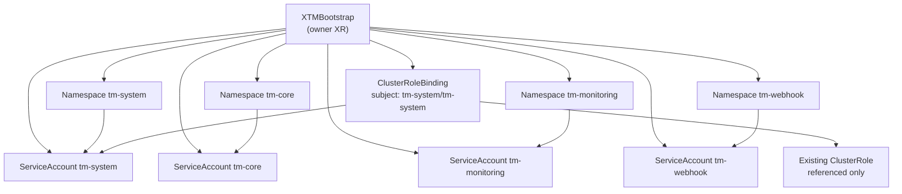

# XTMBootstrap Design

This document records the design of the `XTMBootstrap` owner XR and its Composition.

## 1. Purpose

`XTMBootstrap` models one TM control-plane bootstrap boundary.

It owns:

- four Kubernetes namespaces: `tm-system`, `tm-core`, `tm-monitoring`, `tm-webhook`
- one ServiceAccount in each namespace
- one cluster-scoped `ClusterRoleBinding` for the `tm-system` ServiceAccount

This API exists to bootstrap the fixed namespace and identity layout required by the TM platform.

## 2. Owner vs consumer classification

This is an owner API.

That classification is correct because all managed resources belong to one tightly coupled lifecycle
boundary: if the TM platform bootstrap is removed, the four namespaces, four ServiceAccounts, and
the `tm-system` cluster-scope RBAC binding should be removed with it.

This is not a consumer API because the caller is not requesting a single dependent resource inside
an owner-managed namespace. The caller is requesting the namespace and identity boundary itself.

## 3. Lifecycle boundary

Created and reconciled by this XR:

- `Namespace/tm-system`
- `Namespace/tm-core`
- `Namespace/tm-monitoring`
- `Namespace/tm-webhook`
- `ServiceAccount/tm-system` in `tm-system`
- `ServiceAccount/tm-core` in `tm-core`
- `ServiceAccount/tm-monitoring` in `tm-monitoring`
- `ServiceAccount/tm-webhook` in `tm-webhook`
- one `ClusterRoleBinding` that binds `ServiceAccount/tm-system` to a referenced cluster role

Deleted with this XR:

- the Crossplane-managed `Object` wrappers

Not deleted by provider-kubernetes when this XR is deleted:

- the underlying `Namespace`, `ServiceAccount`, and `ClusterRoleBinding` resources

This Composition sets `managementPolicies` to `Observe`, `Create`, and `Update` only. It
intentionally omits `Delete`, so the owner XR reconciles the TM bootstrap shape without performing
destructive cleanup of the underlying cluster resources.

Referenced instead of owned:

- the cluster role named by `spec.parameters.systemClusterRoleName`

The Composition binds to an existing `ClusterRole`. It does not create or mutate the role itself.

## 4. API shape

The XR stays intentionally narrow.

Required fields:

- `environment`: intent label stamped onto all managed resources
- `systemClusterRoleName`: existing cluster role name bound to `tm-system/tm-system`

Optional fields:

- `providerConfigRef.name`: override the default `crossplane-local` target
- `deletionPolicy`: `Delete` or `Orphan`

Not exposed on purpose:

- free-form namespace names
- arbitrary extra manifests
- per-namespace RBAC fragments
- per-namespace ServiceAccount naming knobs

The names are fixed because this XR is for one specific TM bootstrap shape, not a generic namespace
factory.

## 5. Resource relationship diagram



## 6. Risks and non-goals

Risks:

- `systemClusterRoleName` can grant broad access, including `cluster-admin`, so the caller must
  choose that referenced role deliberately.
- this XR owns cluster-scoped RBAC for `tm-system`, so it should remain limited to one platform
  bootstrap boundary instead of becoming a general-purpose RBAC API.
- deleting the XR does not delete the underlying TM namespaces or identities, so cleanup is an
  explicit day-2 operational action rather than an automatic side effect.

Non-goals:

- deploying TM workloads
- creating custom `ClusterRole` rules
- managing secrets, configmaps, or webhooks
- serving as a reusable generic namespace bundle for unrelated systems

## 7. Example instance

```yaml
apiVersion: platform.k8s.goodnotes.io/v1alpha1
kind: XTMBootstrap
metadata:
  name: tm-bootstrap
spec:
  parameters:
    environment: dev
    systemClusterRoleName: cluster-admin
```
